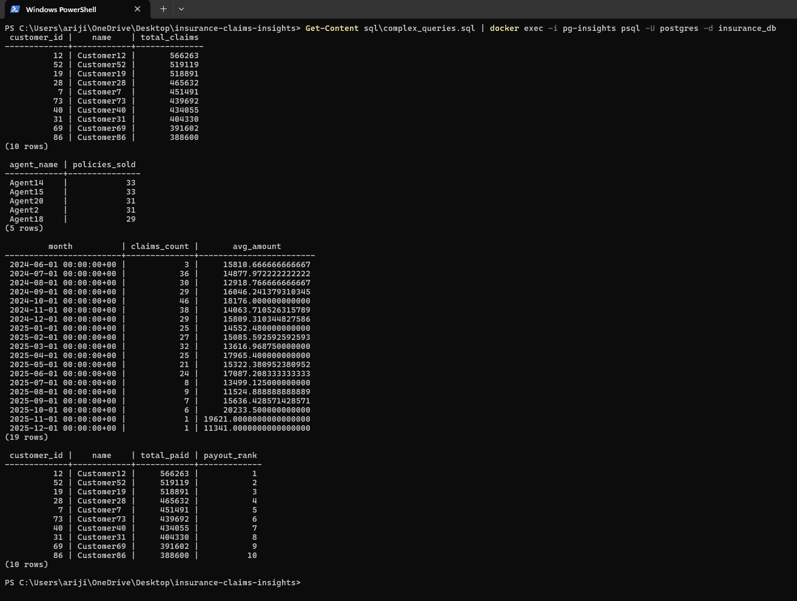
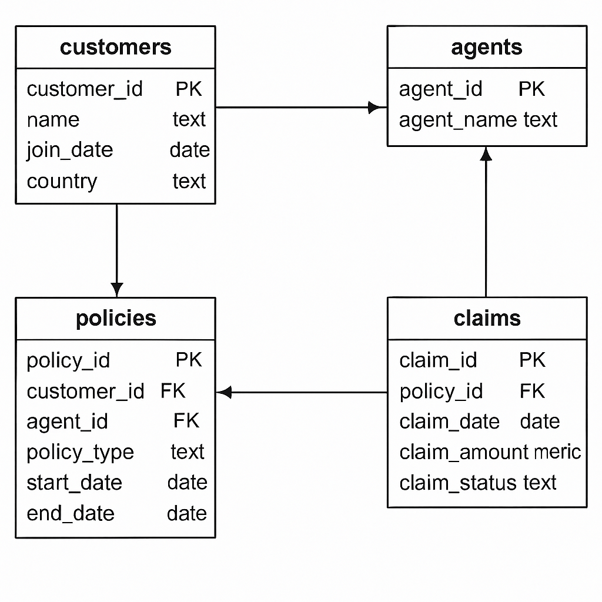

# 🛡️ Insurance Claims Insights — SQL Portfolio Project

This project analyzes an insurance company's operational data using structured SQL. It demonstrates my ability to model relationships, write efficient SQL queries, and produce actionable insights from multi-table datasets.

---

## 🧰 Tech Stack

- PostgreSQL
- Dockerized environment
- SQL (Window Functions, Aggregations, Subqueries)
- ERD diagramming

---

## 🗂️ Project Structure

```
.
├── schema.sql               # Table definitions
├── insert_data.sql          # Sample data
├── complex_queries.sql      # Analytical queries
├── health_checks.sql        # Data sanity & validation queries
├── migration_script.sql     # Sample schema evolution script
├── diagrams/
│   ├── schema.png           # ERD diagram
│   └── sample_results.png   # Sample query output
└── README.md                # Project documentation
```

---

## 🧪 How to Run This Project

1. Clone this repository
2. Spin up PostgreSQL (Docker recommended)
3. Run the scripts in this order:
   - `schema.sql`
   - `insert_data.sql`
   - `complex_queries.sql` or `health_checks.sql`
4. Use a tool like DBeaver or psql to explore the schema and results

```bash
# Sample Docker command to run queries
docker exec -i pg-insights psql -U postgres -d insurance_db < complex_queries.sql
```

---

## 📊 Sample Insights



---

## 🧱 Entity-Relationship Diagram



---

## 💡 Key SQL Concepts Covered

- Joins and subqueries
- Aggregations and GROUP BY
- Filtering with HAVING
- Window functions (RANK, ROW_NUMBER)
- NULL handling with COALESCE
- Monthly time-series aggregation using DATE_TRUNC
- Schema evolution with migration script

---

## 🎯 Why This Project

This project simulates real-world SQL responsibilities:
- Designing schema
- Writing production-grade queries
- Building reports for stakeholders
- Debugging NULLs and handling bad data

It's a complete representation of what a junior SQL Developer or aspiring Data Engineer should be able to build.

---

## 👋 Author

**Arijit Kar**  
SQL Developer | Data Enthusiast  
[LinkedIn](https://www.linkedin.com/in/arijit-kar/)
